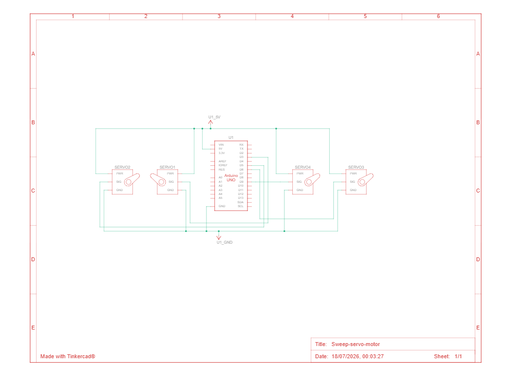
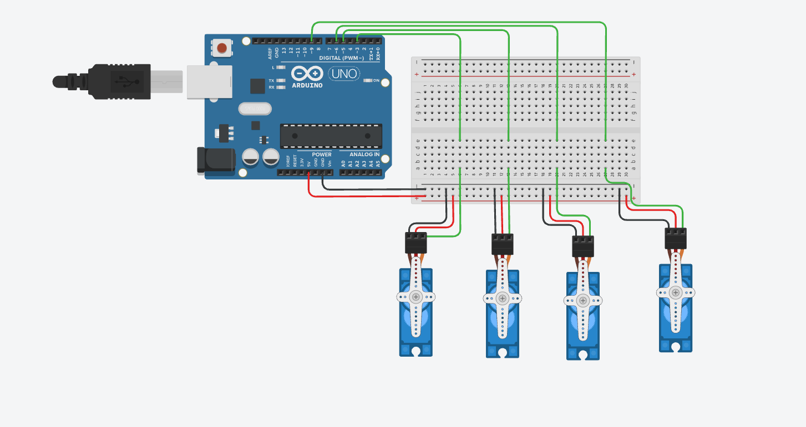

# 🤖 Multi Servo Controller

## 📖 Overview
An Arduino-based hardware project that synchronously drives four SG90 servo motors through a full 180-degree sweep cycle before holding them at a neutral 90-degree position.


## 🛠️ Hardware Requirements
*   🔌 **Microcontroller:** Arduino Uno R3.
*   ⚙️ **Actuators:** 4x SG90 Micro Servo Motors.
*   🔋 **Additional Components:** Breadboard, jumper wires, and an appropriate 5V power supply.

## ⚡ Circuit & Wiring
The servos are powered by the Arduino's 5V and GND. The signal pins for the four servos are routed to the Arduino's digital PWM pins as follows:
*   🟢 **Servo 1:** Pin 3 
*   🟢 **Servo 2:** Pin 5 
*   🟢 **Servo 3:** Pin 6 
*   🟢 **Servo 4:** Pin 9 

### Breadboard Layout


### Electronic Schematic


## 💻 Code Behavior
The logic is entirely contained within the `setup()` function, meaning the sequence runs exactly once when the Arduino is powered or reset. The `loop()` function is intentionally left empty. 

The control flow operates in three distinct steps:
1.  ⏩ **Forward Sweep:** All four servos move synchronously from 0° to 180° in 1-degree increments: . A `delay(5.55)` between each increment ensures the full sweep takes approximately 1 second.
2.  ⏪ **Reverse Sweep:** The servos immediately sweep back from 180° to 0° at the same speed. Also 1 second.
3.  ⏸️ **Hold:** Finally, all servos are commanded to hold at exactly 90° after the sweep for 2 seconds.

## ⚙️ Installation & Usage
1.  🧩 Assemble the hardware on a breadboard according to the provided diagrams. 
2.  📂 Open the `.ino` code file in the Arduino IDE.
3.  📚 Ensure you have the standard `<Servo.h>` library included: .
4.  🚀 Compile and upload the code to your Arduino Uno.

## 📁 File Structure
```text
├── README.md                     # The documentation
├── multi-servo-controller.ino    # Main Arduino sketch code
├── multi-servo-controller.brd    # Eagle board design file
├── schematic.png                 # Electronic schematic image
└── Breadboard-wiring.png         # Breadboard wiring layout image
```
## 🧑‍💻 Author
**Yazid Alasidi**
